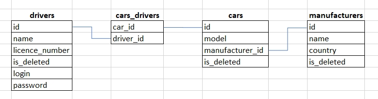

# Project description
Java web application which represents taxi web service. It has been built using Solid principles and authentication services.
Users can manipulate data about drivers, and cars/manufacturers by linking them together or adding/removing them as well.
It provides the ability to register a new user as a driver, filtering available cars for authenticated drivers.

# Technologies
- Java 11
- Maven
- Tomcat
- MySQL
- JDBC
- Javax servlet
- JSP/JSTL
- HTML/CSS

# Features
- login/logout
- registration as a new driver
- add/delete driver, car, manufacture

# Database structure

# How to run this project on your local machine:
- Install JDK 11+
- Install Maven
- Install Tomcat (version 9.0.xx)

- Install IntelliJ IDEA
- Clone this repository (f.e. using VS Code + Git Bash)

- Install MySQL
- Execute SQL script ../resources/init_db.sql
- Configure ../util/ConnectionUtil.java (username and etc.)

- Thank you!
